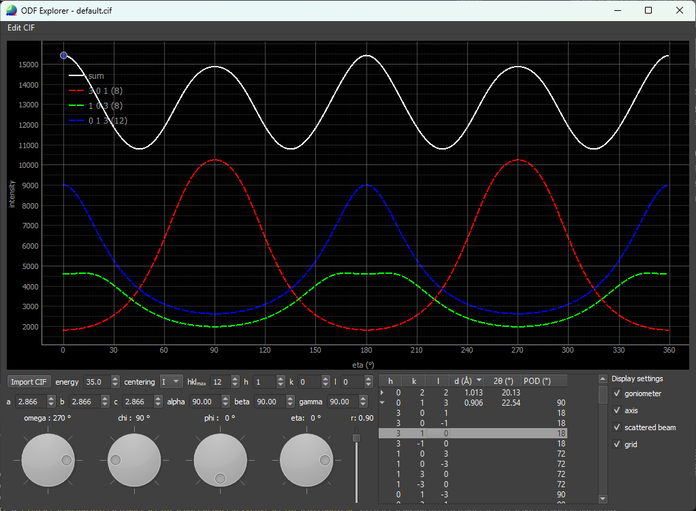

# ODFex
## Orientation Distribution Function Explorer
#### A simple visualization tool intended to help interpret or predict the azimuthal variation in X-ray powder diffraction data  
- 3D visualization of ODF (so far only fibre texture) in relation to the sample orientation  
- Visualization of the scattering vector $\vec{Q}$ and the contributing crystallite direction along the preferred orientation direction cone (POD)  
- Visualization of the azimuthal intensity variation of reflections at similar $2\theta$-values and their summed contribution  
- Easy drag-n-drop import of CIF files

### Examples
The images below show the two main windows in ODFex, the main window containing the user input interface and a plot of the azimuthal intensities of the selected reflections, and the 3D sphere window showing the ODF along with several relevant vectors and cone segments.
  

  

### Acknowledgements
The visuals, naming convention, and underlying math is heavily inspired by Wright et al. (1996)
### References
 [Wright, N. G., Nelmes, R. J., Belmonte, S. A., & McMahon, M. I. (1996). *Observation and modelling of preferred orientation in two-dimensional powder patterns.* Journal of Synchrotron Radiation, 3(3), 112-119.](https://doi.org/10.1107/S0909049596003627)